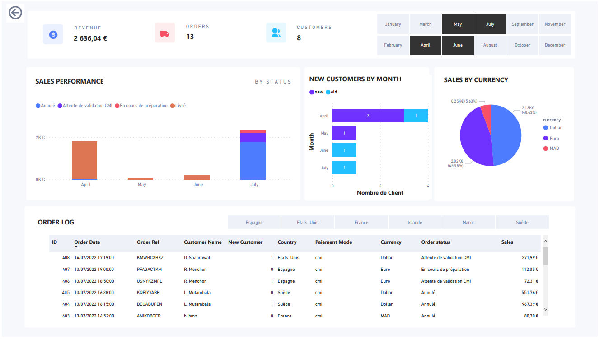

# 🛒 E-commerce KPI Dashboard – Business Intelligence for Retail

 <!-- Replace with actual image path -->

## 📌 Project Overview

This Power BI project presents an end-to-end Business Intelligence (BI) dashboard tailored for monitoring **e-commerce KPIs**. It is designed to help retail businesses track and analyze key performance indicators such as **sales revenue**, **orders**, **customer activity**, and **geographic distribution**.

The dataset simulates activity from **PrestaShop**, a leading e-commerce platform. The dashboard provides actionable insights into sales operations, customer behavior, and financial trends across multiple currencies and countries.

---

## 📊 Dashboard Sections Breakdown

### 1. Global KPIs

- **Revenue**: Total earnings over the selected period.
- **Orders**: Total number of orders placed.
- **Customers**: Number of unique customers (new and returning).

These KPIs give a high-level overview of business performance and growth.

---

### 2. Sales Performance by Status

This section tracks the lifecycle of orders based on their current status:

- `Paiement accepté` (Payment Accepted)  
- `En cours de préparation` (In Preparation)  
- `Expédié` (Shipped)  
- `Livré` (Delivered)  
- `Annulé` (Cancelled)  
- `Remboursé` (Refunded)  
- `Attente de validation CMI` (Pending CMI Validation)

It helps monitor operational efficiency and detect bottlenecks in order processing.

---

### 3. Order Log Table

A detailed table displaying:

- Order ID
- Date
- Customer Name
- Country
- Payment Method
- Currency
- Order Status
- Order Amount

This granular view enables customer support teams and analysts to drill into individual transactions and customer details.

---

### 4. Sales by Currency

Displays revenue distribution across:

- Euro (€)
- Dollar ($)
- Moroccan Dirham (MAD)

Useful for understanding international sales dynamics and currency exposure.

---

### 5. New Customers by Month

Bar chart showing the number of **new customers** acquired each month.  
It supports tracking marketing efforts, growth over time, and customer engagement trends.

---

### 6. Geographical Distribution

Orders are broken down by countries such as:

- France
- United States
- Spain
- Morocco
- China
- Germany
- Sweden
- Iceland
- Switzerland
- Belgium

This provides insights into top-performing markets and regional sales performance.

---

## 🛠️ Tools & Technologies

- **Power BI Desktop** – Data modeling & visualization
- **DAX (Data Analysis Expressions)** – KPI calculations
- **Power Query** – Data transformation and cleanup
- **PrestaShop** – Simulated e-commerce dataset source

---

## 📈 Business Impact

This dashboard helps retail stakeholders to:

- Monitor **real-time performance**
- Identify sales trends and processing delays
- Assess **customer acquisition patterns**
- Make informed **data-driven decisions**

---
## 🧠 What I Learned

Through this project, I enhanced my skills in:

- Designing executive-ready BI dashboards
- Applying DAX for dynamic metric computation
- Turning raw e-commerce data into actionable insights

